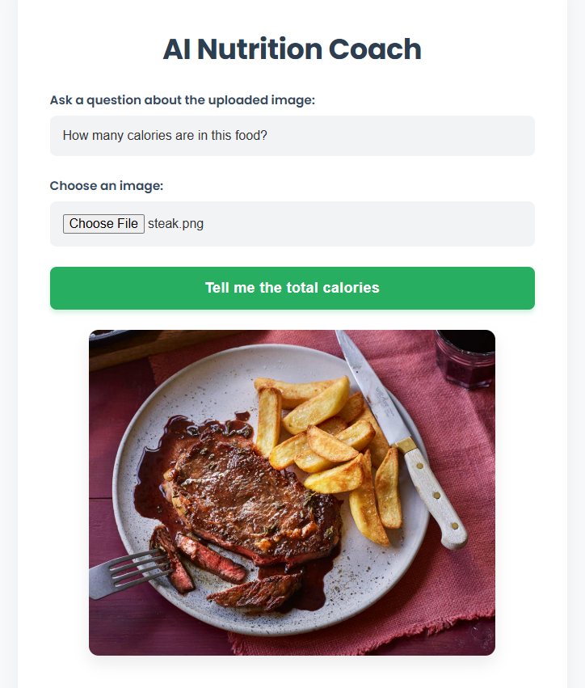
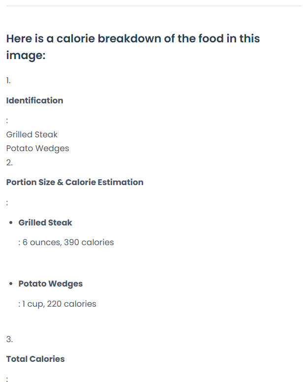

# AI Nutrition Coach (Calorie Coach App)

A multimodal AI application that analyzes images of food to provide detailed nutritional coaching, calorie estimation, and health evaluations. Built with **Flask** and powered by **IBM Watsonx.ai** (Llama-4).



## Features

*   **Image Analysis**: Upload photos of your meals to get instant AI feedback.
*   **Calorie Estimation**: Identifies food items and estimates portion sizes and calories.
*   **Nutrient Breakdown**: detailed breakdown of Protein, Carbs, Fats, Vitamins, and Minerals.
*   **Health Evaluation**: AI-generated assessment of the meal's healthiness.
*   **Responsive UI**: Clean, modern interface for easy interaction.

## Tech Stack

*   **Backend**: Python, Flask
*   **AI/ML**: IBM Watsonx.ai SDK, Llama-4-17b-instruct model
*   **Frontend**: HTML5, CSS3, Vanilla JavaScript
*   **Environment**: Python Virtual Environment

## Prerequisites

*   Python 3.8+
*   IBM Cloud Account with Watsonx.ai access
*   An IBM Cloud API Key

## Installation

1.  **Clone the repository**
    ```bash
    git clone https://github.com/vvduth/cal_coach_app.git
    cd cal_coach_app
    ```

2.  **Set up a virtual environment**
    ```bash
    # Windows
    python -m venv my_env
    my_env\Scripts\activate

    # macOS/Linux
    python3 -m venv my_env
    source my_env/bin/activate
    ```

3.  **Install Dependencies**
    ```bash
    pip install flask ibm-watsonx-ai python-dotenv requests pillow
    ```

4.  **Configuration**
    *   Create a `.env` file in the root directory.
    *   Add your IBM Watsonx API Key:
        ```env
        WATSONX_APIKEY=your_ibm_cloud_api_key_here
        ```
    *   *Note*: The `project_id` and region URL are currently configured in `app.py`. Update them if necessary.

##  Usage

1.  **Start the Application**
    ```bash
    python app.py
    ```

2.  **Access the App**
    Open your browser and navigate to: `http://127.0.0.1:5000`

3.  **Analyze Food**
    *   Click "Choose an image" to upload a food photo.
    *   (Optional) Modify the question prompt.
    *   Click "Tell me the total calories".

## Project Structure

```
cal_coach_app/
├── app.py                # Main application logic & AI integration
├── templates/
│   └── index.html        # Frontend HTML template
├── static/
│   └── style.css         # UI Styling
├── my_env/               # Virtual environment (excluded from git)
├── .env                  # Secrets configuration (excluded from git)
└── .github/              # GitHub configurations & Agent instructions
```

## Disclaimer

The nutritional information provided by this application is for informational purposes only and is based on AI estimates. It should not be considered medical advice.
